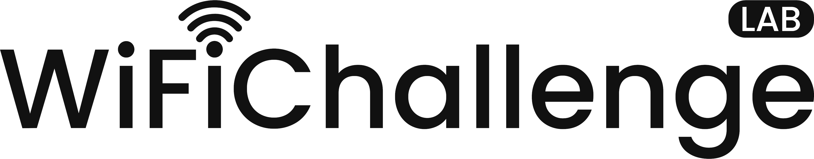

<p align="center">
  
</p>

<p align="center">
   <a href="https://github.com/r4ulcl/WiFiChallengeLab-docker/releases">
    
  </a>
  <a href="https://github.com/r4ulcl/WiFiChallengeLab-docker/stargazers">
    
  </a>
  <a href="https://github.com/r4ulcl/WiFiChallengeLab-docker/network">
    
  </a>
  <a href="https://github.com/r4ulcl/WiFiChallengeLab-docker/issues">
    
  </a>
  <a href="https://github.com/r4ulcl/WiFiChallengeLab-docker/blob/main/LICENSE">
    
  </a>
</p>


# WiFiChallengeLab-docker


[](https://hub.docker.com/r/r4ulcl/wifichallengelab-aps) [](https://hub.docker.com/r/r4ulcl/wifichallengelab-clients)


Docker version of WiFiChallenge Lab with modifications in the challenges and improved stability. Ubuntu virtual machine with virtualized networks and clients to perform WiFi attacks on OPN, WPA2, WPA3 and Enterprise networks. 


## CTFd Lab

For direct access to download the VM and complete the challenges go to the CTFd web site: 

[WiFiChallenge Lab v2.0](https://wifichallengelab.com/)


## Changelog from version v1.0

The principal changes from version 1.0.5 to 2.0.3 are the following. 
- Remove Nested VMs. Replaced with Docker
- Add new attacks and modify the existent to make them more real
    - WPA3 bruteforce and downgrade
    - MGT Multiples APs
    - Real captive portal evasion (instead of just MAC filtering)
    - Phishing client with fake website.
- Eliminating the WPS pin attack as it is outdated, unrealistic, and overly simplistic.
- Use Ubuntu as SO instead of Debian
- Use vagrant to create the VM to be easy to replicate
- More Virtual WiFi adapters
    - More APs
    - More clients
- Monitorization and detection using nzyme WIDS.

## Install

### Using the VM

Download the VM for VMWare or VirtualBox:

- [GitHub releases](https://github.com/r4ulcl/WiFiChallengeLab-docker/releases)
- [Proton Drive](https://drive.proton.me/urls/Q4WPB23W7R#Qk4nxMH8Q4oQ)

### Docker inside a Linux host or a custom VM

Download the repository and start the docker with the APs, the clients and nzyme for alerts. 

``` bash
git clone https://github.com/r4ulcl/WiFiChallengeLab-docker
cd WiFiChallengeLab-docker
docker-compose up -d --file docker-compose.yml
```

#### Optionally: Install Wi-Fi tools

Go to the folder where the tools will be installed and execute `Attacker/installTools.sh`

### Create your own VM using vagrant

#### Requirements

- A host with at least 4 CPU cores and 4 GB of RAM.
- vagrant

#### Create the VM with vagrant

``` bash
git clone https://github.com/r4ulcl/WiFiChallengeLab-docker
cd WiFiChallengeLab-docker
cd vagrant
```

Edit file vagrantfile memory and CPU to your needs. 

``` bash
nano vagrantfile
```

If you want a VMWare VM:

``` bash
vagrant up vmware_vm 
```

And for a VirtualBox VM:
``` bash
vagrant up virtualbox_vm 
```

## Usage

### Attack from Ubuntu VM
- The tools are installed and can be found in the tools folder of the root home. 
- There are 7 antennas available, wlan0 to wlan6.
- Do not disturb mode can be disabled with the following command. 

### Attack from Host
- Start the docker-compose.yml file and use the virtual WLAN. 
- Use your own tools and configurations to attack. 

### Attack from Docker Attacker
- TODO

## Modify config files
To modify the files you can download the repository and edit both APs and clients (in the VM the path is /var/WiFiChallenge). The files are divided by APs, Clients, and Nzyme files.

## Recompile Docker
To recreate the Docker files with the changes made, modify the docker-compose.yml file by commenting out the "image:" line in each Docker and uncommenting the line with "build:". Then use "docker-compose build" to create a new version.

## Support this project

### Buymeacoffee

[](https://www.buymeacoffee.com/r4ulcl)
 
## License

[GNU General Public License v3.0](https://github.com/r4ulcl/WiFiChallengeLab-docker/blob/main/LICENSE)
