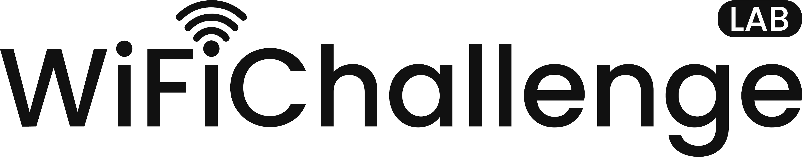

<p align="center">
  
</p>

<p align="center">
  <a href="https://github.com/r4ulcl/WiFiChallengeLab-docker/releases"></a>
  <a href="https://github.com/r4ulcl/WiFiChallengeLab-docker/blob/main/LICENSE"></a>
  <a href="https://github.com/r4ulcl/WiFiChallengeLab-docker/commits/main"></a>
  <a href="https://github.com/r4ulcl/WiFiChallengeLab-docker/commits/dev"></a>
  <a href="https://github.com/r4ulcl/WiFiChallengeLab-docker"></a>
</p>

<p align="center">
  <a href="https://github.com/r4ulcl/WiFiChallengeLab-docker/stargazers"></a>
  <a href="https://github.com/r4ulcl/WiFiChallengeLab-docker/network/members"></a>
  <a href="https://github.com/r4ulcl/WiFiChallengeLab-docker/issues"></a>
  <a href="https://github.com/r4ulcl/WiFiChallengeLab-docker/graphs/contributors"></a>
  <a href="https://github.com/r4ulcl/WiFiChallengeLab-docker"></a>
</p>

<p align="center">
  <a href="https://hub.docker.com/r/r4ulcl/wifichallengelab-aps"></a>
  <a href="https://hub.docker.com/r/r4ulcl/wifichallengelab-aps"></a>
  <a href="https://hub.docker.com/r/r4ulcl/wifichallengelab-clients"></a>
  <a href="https://hub.docker.com/r/r4ulcl/wifichallengelab-clients"></a>
  <a href="https://hub.docker.com/r/r4ulcl/wifichallengelab-nzyme"></a>
  <a href="https://hub.docker.com/r/r4ulcl/wifichallengelab-nzyme"></a>
</p>

<p align="center">
  <a href="https://github.com/r4ulcl/WiFiChallengeLab-docker/actions/workflows/docker-image-aps.yml"></a>
  <a href="https://github.com/r4ulcl/WiFiChallengeLab-docker/actions/workflows/docker-image-clients.yml"></a>
  <a href="https://github.com/r4ulcl/WiFiChallengeLab-docker/actions/workflows/docker-image-nzyme.yml"></a>
</p>

<p align="center">
  <a href="https://github.com/r4ulcl/WiFiChallengeLab-docker/actions/workflows/docker-image-aps-dev.yml"></a>
  <a href="https://github.com/r4ulcl/WiFiChallengeLab-docker/actions/workflows/docker-image-clients-dev.yml"></a>
  <a href="https://github.com/r4ulcl/WiFiChallengeLab-docker/actions/workflows/docker-image-nzyme-dev.yml"></a>
</p>

<h1 align="left">WiFiChallengeLab-docker</h1>


Docker version of WiFiChallenge Lab with modifications in the challenges and improved stability. Debian virtual machine with virtualized networks and clients to perform WiFi attacks on OPN, WPA2, WPA3 and Enterprise networks.

## CTFd Lab

For direct access to download the VM and complete the challenges go to the CTFd web site:

[WiFiChallenge Lab v2.0](https://lab.WiFiChallenge.com/)

## Changelog from version v1.0

The principal changes from version 1.0.5 to 2.0.3 are the following.

- Remove Nested VMs. Replaced with Docker
- Add new attacks and modify the existent to make them more real
  - WPA3 bruteforce and downgrade
  - MGT Multiples APs
  - Real captive portal evasion (instead of just MAC filtering)
  - Phishing client with fake website.
- Eliminating the WPS pin attack as it is outdated, unrealistic, and overly simplistic.
- Use Ubuntu as SO instead of Debian (Debian again in version 2.3).
- Use vagrant to create the VM to be easy to replicate
- More Virtual WiFi adapters
  - More APs
  - More clients
- Monitorization and detection using nzyme WIDS.

Changes after v2.0 can be found at [Changelog.md](https://github.com/r4ulcl/WiFiChallengeLab-docker/blob/main/Changelog.md)

## Using WiFiChallenge Lab

> [!WARNING]  
> This compose file uses `network_mode: host`, `privileged: true` , **and mounts** `/lib/modules`, giving the container direct host-network access and full kernel privileges, run it only inside a VM, **never** on your physical host.


### Using the Virtual Machine (VM) from the Releases or Proton Drive

To get started with the VM, download the appropriate version for your preferred platform:

- [From GitHub releases](https://github.com/r4ulcl/WiFiChallengeLab-docker/releases)
- [From Proton Drive](https://drive.proton.me/urls/Q4WPB23W7R#Qk4nxMH8Q4oQ)

### Using Docker on a Linux Host or Custom VM with Debian 12 (Supports x86-64 and ARM)

1. Download a Debian 12 VM
2. Execute the following code as root

``` bash
cd /var/
git clone https://github.com/r4ulcl/WiFiChallengeLab-docker
bash /var/WiFiChallengeLab-docker/vagrant/install.sh
```

3. Reboot and login with user/user
4. Continue in lab.wifichallenge.com

### Using Docker on a Linux Host or Custom VM like a kali linux

Clone the repository and set up Docker to manage Access Points (APs), clients, and nzyme for alerts:

```bash
git clone https://github.com/r4ulcl/WiFiChallengeLab-docker
cd WiFiChallengeLab-docker
docker compose --file docker-compose.yml up -d
```

### Create your own VM using vagrant

#### Requirements

- A host with at least 4 CPU cores and 4 GB of RAM.
- vagrant
- VirtualBox, VMware or Hyper-V

#### Create the VM with vagrant

```bash
git clone https://github.com/r4ulcl/WiFiChallengeLab-docker
cd WiFiChallengeLab-docker
cd vagrant
```

Edit file vagrantfile memory and CPU to your needs.

```bash
nano vagrantfile
```

If you want a VMWare VM:

```bash
vagrant up vmware_vm 
```

For a VirtualBox VM:

```bash
vagrant up virtualbox_vm 
```

And for a Hyper-v VM, in a admin console:

```bash
vagrant up hyper-v_vm --provider=hyperv
```

### Create the VM manually (M1, M2, etc recommended)

- Download a Debian 12 VM
- Execute the following code as root

```bash
cd /var/
git clone https://github.com/r4ulcl/WiFiChallengeLab-docker
bash /var/WiFiChallengeLab-docker/vagrant/install.sh
```

## Usage

### Attack from Debian VM

- The tools are installed and can be found in the tools folder of the root home.
- There are 7 antennas available, wlan0 to wlan6.
- Do not disturb mode can be disabled with the following command.

### Attack from Host

- Start the docker-compose.yml file and use the virtual WLAN.
- Use your own tools and configurations to attack.

### Attack from Docker Attacker

- TODO

## Modify config files

To modify the files you can download the repository and edit both APs and clients (in the VM the path is /var/WiFiChallengeLab-docker). The files are divided by APs, Clients, and Nzyme files.

## Recompile Docker

To recreate the Docker files with the changes made, modify the docker-compose.yml file by commenting out the "image:" line in each Docker and uncommenting the line with "build:". Then use "docker compose build" to create a new version.

## Open Source References

See [OPEN_SOURCE_REFERENCES.md](./OPEN_SOURCE_REFERENCES.md) for the upstream projects, repositories, and licenses used in the lab. Update it when adding tools or changing install scripts.


## Support this project

### Certified WiFiChallenge Professional (CWP)

<p align="center">
  <a href="https://academy.wifichallenge.com/courses/certified-wifichallenge-professional-cwp">
    
  </a>
</p>

  
## Collaborators

- Raúl Sampedro (@rsrdesarrollo) - Update the Nzyme Docker configuration to support ARM architecture

- Oscar Alfonso (OscarAkaElvis / v1s1t0r, [airgeddon](https://github.com/v1s1t0r1sh3r3/airgeddon) author) - Collaboration in testing and script improvement

## License

[GNU General Public License v3.0](https://github.com/r4ulcl/WiFiChallengeLab-docker/blob/main/LICENSE) 
